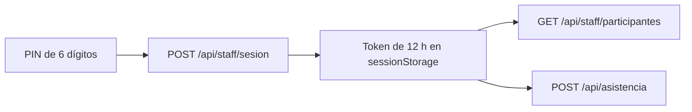

# Arquitectura de App QR

La arquitectura de la **App QR - Encuadre 2026** está diseñada para ser resiliente a fallos de red y adaptada para dispositivos móviles (PWA). A continuación se documenta el diseño de sus componentes principales.

## Client-Side Rendering (CSR) con Vite
El proyecto usa Vite como empaquetador para generar una aplicación de una sola página (SPA). Todo el renderizado y la manipulación del DOM se hacen de forma manual en `src/main.ts` reduciendo la dependencia de librerías externas.

## Módulos y Flujo de Datos

1. **`src/main.ts` (controlador de la interfaz):**
   Escucha eventos del DOM y delega en el resto de módulos.
2. **`src/api.ts` (sesión, red y cola):**
   Canjea el PIN por un token, hace las peticiones al Cloudflare Worker con ese
   token, y gestiona la cola sin conexión en `localStorage`. Traduce los errores
   del servidor a un `ErrorApi` con `codigo` y `mensaje`.
3. **`src/scanner.ts` (hardware):**
   Envuelve `html5-qrcode`. Está aislado para poder ajustar el *framerate* y
   reducir el uso de CPU, evitando que el teléfono se caliente.
4. **`src/actualizacion.ts` (versiones):**
   Detecta que ha entrado una versión nueva y recarga la app, y pregunta por una
   cada vez que vuelve al primer plano.
5. **`src/utils.ts` (utilidades puras):**
   Funciones sin estado —formatear fechas, iniciales, escapado— fáciles de probar.
6. **`src/config.ts` · `src/types.ts`:**
   Constantes y formas de los datos. `config.ts` **no contiene ninguna
   credencial**: es justamente donde estaba el problema.

## Autenticación

Hasta agosto de 2026 la app se autenticaba con `VITE_ADMIN_SECRET`, y **Vite
incrusta las variables `VITE_*` en el paquete que descarga el navegador**: la
credencial que abre el padrón completo —con CURP y teléfono—, la aprobación de
pagos y el borrado de registros viajaba dentro de un archivo JavaScript público.
El PIN tampoco protegía nada: era una comparación contra `'2026'` escrita en el
propio código.

Ahora **no queda ninguna credencial en el paquete**. El PIN lo teclea una
persona, el Worker lo valida contra un secreto que nunca sale del servidor, y el
token vive en `sessionStorage`, que se vacía al cerrar la pestaña. Lo que ese
token abre es una sola lectura reducida: sin CURP, teléfono ni correo, y sin
acceso a ninguna ruta de administración.

`scripts/revisar-paquete.mjs` revisa el JavaScript compilado antes de publicar y
falla si encuentra una credencial dentro. Un linter no puede atrapar esto: leer
`import.meta.env.VITE_ALGO` es código válido, y el problema solo es visible en el
resultado de compilar.

## Resiliencia Offline (Offline Queue)
Uno de los pilares de la arquitectura es su capacidad offline. Si el dispositivo pierde conexión al marcar una asistencia:
- El ID del asistente se almacena en el arreglo `OfflineQueueItem[]` en `localStorage`.
- Se muestra un icono indicador de espera al operador en la UI.
- Un evento `window.addEventListener('online')` se mantiene activo. En cuanto
  hay conexión, `syncOfflineQueue` envía las asistencias pendientes al Worker
  **de una en una**, quitando de la cola las que sí entran. Antes se lanzaban
  todas a la vez con `Promise.all` y bastaba que una fallara para conservar la
  cola entera, de modo que las ya registradas se reintentaban en cada
  sincronización.
- **Solo se encola lo que falló por falta de red.** Antes se encolaba cualquier
  fallo y se anunciaba como «guardado sin conexión»: una sesión caducada o un
  participante inexistente quedaban en la cola para siempre mientras al personal
  se le decía que había quedado registrado. Ahora una sesión caducada devuelve
  al PIN y el resto de errores muestran su motivo real.

## Actualización de la app

El service worker sirve la app desde la caché, así que una versión nueva no
llega sola a un dispositivo que ya la tenía: `registerSW.js` solo registra, y la
página cargada sigue ejecutando el código viejo hasta que alguien la recargue.

Eso ocurrió al desplegar el acceso por PIN, y no fue una molestia menor: la
versión vieja pedía el padrón con un secreto ya rotado, se callaba el 401 y
dejaba la lista vacía, así que **cualquier QR escaneado salía como «no
encontrado en la base de datos»**.

Ahora la app escucha el cambio de control del service worker y se recarga sola,
y comprueba si hay versión nueva cada vez que vuelve al primer plano. La pantalla
del PIN muestra abajo la versión que está corriendo, para poder diagnosticar un
teléfono a distancia.
