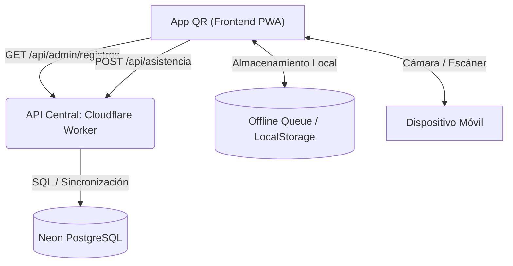

# App QR — Documentación

Sistema de control de acceso y registro de asistencia por código QR para el 36 FTD Encuadre 2026. Arquitectura basada en una PWA (Vite), Cloudflare Workers (Backend Serverless) y Tipado Estricto (TypeScript).

## Resumen ejecutivo

- **Aplicación PWA**: Aplicación instalable en móviles construida con **Vite** y `vite-plugin-pwa`, con soporte 100% offline y sincronización retardada.
- **Backend Serverless**: Se comunica con una API central impulsada por **Cloudflare Workers** (compartida con el proyecto principal).
- **Escaneo Óptimo**: Escáner QR optimizado para reducir ciclos de CPU a través de `html5-qrcode`.
- **Tipado Estricto & Calidad**: Todo el código cliente está escrito en **TypeScript** con verificación estricta (`strict: true`) y formateo por Prettier/ESLint.
- **Despliegue Automático**: Integración continua (CI/CD) mediante GitHub Actions con despliegue automático a GitHub Pages.

## Público objetivo

- Operadores de registro y control de acceso (Staff Encuadre 2026).
- Desarrollo y mantenimiento técnico.

## Arquitectura de alto nivel



## Mapa del repositorio

- `src/` — Código fuente del frontend (TypeScript, Vite, CSS).
  - `api.ts` — Manejo de red y lógica de sincronización offline.
  - `scanner.ts` — Controlador del hardware de la cámara (`html5-qrcode`).
  - `main.ts` — Control de la UI y flujos de usuario.
  - `utils.ts` — Utilidades puras y de formateo de datos.
- `public/` — Recursos estáticos, íconos y manifiestos de la PWA.
- `.github/workflows/` — Pipeline de CI/CD para compilación y publicación.
- `tests/` — Pruebas Unitarias con Vitest.

## Inicio rápido (Desarrollo Local)

**1. Instalar dependencias:**

```bash
npm install
```

**2. Configurar variables de entorno:**
Copia el archivo `.env.example` a `.env` y configura el secreto administrativo.
```bash
cp .env.example .env
```

**3. Levantar servidor local:**

```bash
npm run dev
```

**4. Validaciones de calidad:**

```bash
npm run lint
npm run test
npm run build
```

## Documentación

- [ARCHITECTURE.md](ARCHITECTURE.md) - Diseño de componentes, PWA y cola offline.
- [API_REFERENCE.md](API_REFERENCE.md) - Endpoints y payloads consumidos por la aplicación.
- [DEPLOYMENT.md](DEPLOYMENT.md) - Pipeline de CI/CD, GitHub Actions y Despliegue.
- [SECURITY.md](SECURITY.md) - Políticas de seguridad, manejo de secretos y sesiones de la PWA.
- [CONTRIBUTING.md](CONTRIBUTING.md) - Flujo Git, estilos de código y Vitest.
- [TROUBLESHOOTING.md](TROUBLESHOOTING.md) - Solución a problemas con cámaras, permisos o modo offline.
- [MAINTAINERS.md](MAINTAINERS.md) - Contactos y responsabilidades.
- [CHANGELOG.md](CHANGELOG.md) - Registro histórico de versiones y migración.
- [LICENSE](LICENSE) - Licencia propietaria.

## Enlaces de producción

- App QR (PWA): https://encuadre2026.github.io/app-qr/
- API backend: https://encuadre-2026-api.sitio-392.workers.dev
