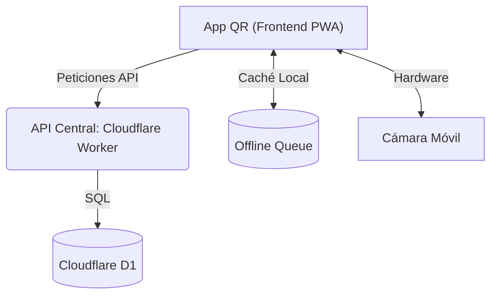

# App QR — Documentación

Sistema de control de acceso y registro de asistencia por código QR para el 36 FTD Encuadre 2026. Arquitectura basada en una PWA (Vite), Cloudflare Workers (Backend Serverless) y Tipado Estricto (TypeScript).

## Resumen ejecutivo

- **Aplicación PWA**: Aplicación instalable en móviles construida con **Vite** y `vite-plugin-pwa`, con soporte 100% offline y sincronización retardada.
- **Backend Serverless**: Se comunica con una API central impulsada por **Cloudflare Workers** (compartida con el proyecto principal).
- **Escaneo Óptimo**: Escáner QR optimizado para reducir ciclos de CPU a través de `html5-qrcode`.
- **Tipado Estricto & Calidad**: Todo el código cliente está escrito en **TypeScript** con verificación estricta (`strict: true`). ESLint y Prettier corren como puerta en CI: `npm run lint` y `npm run format`.
- **Despliegue Automático**: Integración continua (CI/CD) mediante GitHub Actions con despliegue automático a GitHub Pages.

## Público objetivo

- Operadores de registro y control de acceso (Staff Encuadre 2026).
- Desarrollo y mantenimiento técnico.

## Arquitectura de alto nivel



## Mapa del repositorio

- `src/` — Código fuente del frontend (TypeScript, Vite, CSS).
  - `api.ts` — Sesión, red y cola sin conexión. Traduce los errores del servidor.
  - `actualizacion.ts` — Detecta versiones nuevas y recarga la app.
  - `scanner.ts` — Controlador de la cámara (`html5-qrcode`).
  - `main.ts` — Control de la interfaz y flujos de usuario.
  - `utils.ts` — Utilidades puras y de formateo.
  - `config.ts` — Constantes. **No contiene ninguna credencial.**
- `public/` — Recursos estáticos, iconos y manifiesto de la PWA.
- `scripts/revisar-paquete.mjs` — Revisa el paquete compilado en busca de credenciales.
- `.github/workflows/` — Verificación en el PR y publicación desde `main`.
- `tests/` — Pruebas unitarias con Vitest.

## Inicio rápido (Desarrollo Local)

**1. Instalar dependencias:**

```bash
npm install
```

**2. Variables de entorno:**
No hace falta ninguna. La app **no recibe credenciales en tiempo de compilación**:
el acceso se obtiene tecleando el PIN, que el Worker canjea por un token temporal.

Cualquier variable `VITE_*` acabaría dentro del paquete público —así se filtró el
`ADMIN_SECRET` hasta agosto de 2026—, y `npm run revisar:paquete` falla si
aparece alguna.

**3. Levantar servidor local:**

```bash
npm run dev
```

**4. Validaciones de calidad:**

```bash
npm run verificar   # tipos, pruebas, compilación y revisión del paquete
```

Es exactamente lo que ejecuta CI, en el pull request y como puerta antes de
publicar. Por separado:

```bash
npm run typecheck
npm test
npm run build
npm run revisar:paquete
```

## Documentación

- [ARCHITECTURE.md](ARCHITECTURE.md) - Diseño de componentes, PWA y cola offline.
- [API_REFERENCE.md](API_REFERENCE.md) - Endpoints y payloads consumidos por la aplicación.
- [DEPLOYMENT.md](DEPLOYMENT.md) - Pipeline de CI/CD, GitHub Actions y Despliegue.
- [SECURITY.md](SECURITY.md) - Políticas de seguridad, manejo de secretos y sesiones de la PWA.
- [CONTRIBUTING.md](CONTRIBUTING.md) - Flujo Git, estilos de código y Vitest.
- [TROUBLESHOOTING.md](TROUBLESHOOTING.md) - Solución a problemas con cámaras, permisos o modo offline.
- [MAINTAINERS.md](MAINTAINERS.md) - Contactos y responsabilidades.
- [CHANGELOG.md](CHANGELOG.md) - Registro histórico de versiones y migración.
- [LICENSE](LICENSE) - Licencia propietaria.

## Enlaces de producción

- App QR (PWA): https://encuadre2026.github.io/app-qr/
- API backend: https://encuadre-2026-api.sitio-392.workers.dev
